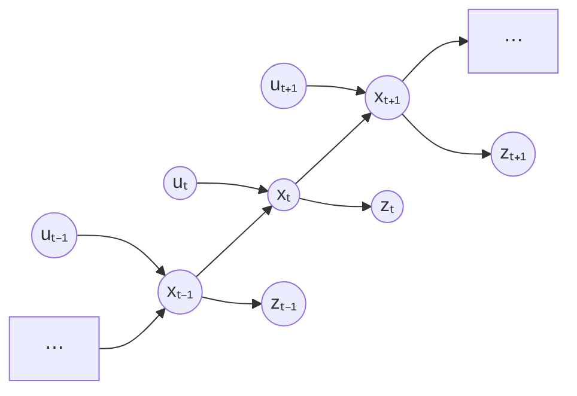

My understanding on the Kalman filter

In general, Kalman filter broadly speaking has three parts: Bayesian filter, Gaussian assumption, and linear system assumption.

I am trying to make a full tutorial. Right now, i will cover them one by one, only parts unfamiliar to me first :(.

## Linear System Assumption

Linear system: System that has “additivity” \(plus\) and “homogeneity” \(multiply\).

I.e., for system \(y=T(x)\), it is linear iff:

1. $$
   T(x_1+x_2)=T(x_1)+T(x_2)
   $$

2. $$
   T(ax)=aT(x)
   $$

$$
\Rightarrow\quad
T(ax_1+bx_2)=aT(x_1)+bT(x_2)
$$

An nonlinear example would be sin(x).

## Bayesian Filter

Start from **conditional Bayes' rule**:

$$
P(x\mid y,z)
=
\frac{P(y\mid x,z)P(x\mid z)}{P(y\mid z)}
$$

Remark: It is just Bayes rule and all terms now conditioned on z. You can easily verify it using the law of conditional probability.

It is also referred as:

$$
\text{posterior}
=
\frac{\text{likelihood}\cdot\text{prior}}{\text{evidence}}
$$

Also state **conditional independence**:

If \(x\) independent of \(y\) given \(z\), i.e.,

$$
P(x,y\mid z)=P(x\mid z)P(y\mid z),
$$

we have

$$
P(x\mid z)=P(x\mid z,y)
$$

and

$$
P(y\mid z)=P(y\mid z,x).
$$

> **Example:**
>
> \(x\): midterm  
> \(y\): final  
> \(z\): their real level
>
> If midterm good, you may think final also good.
>
> If real level known, \(x,y\) fluctuations don't matter.

> **Explaining away:**
>
> \(x\): earthquake  
> \(y\): thief  
> \(z\): alarm
>
> \(x\perp y\), but given \(z,x\), you may not think thief.

## Bayes Filter

We are given:

1. Stream of observations \(\{z\}\) and actions \(\{u\}\):
   $$
   \{u_{1:t},z_{1:t}\}
   $$

2. Sensor model:
   $$
   P(z_t\mid x_t)
   $$
   \(x_t\) is the state at \(t\).

3. Action model:
   $$
   P(x_t\mid x_{t-1},u_t)
   $$

4. Prior probability of state:
   $$
   P(x_{t-1}\mid u_{1:t-1},z_{1:t-1})
   $$

Wanted: Posterior, or also called belief:

$$
\operatorname{Bel}(x_t)
=
P(x_t\mid u_{1:t},z_{1:t})
$$

Assume: **Markov assumption**

Once \(x_t\) is known, \(z_{1:t-1},u_{1:t}\) independent of \(z_t\).

$$
P(z_t\mid x_{0:t},z_{1:t-1},u_{1:t})
=
P(z_t\mid x_t)
$$

$$
P(x_t\mid x_{0:t-1},z_{1:t-1},u_{1:t})
=
P(x_t\mid x_{t-1},u_t)
$$

### Derivation

$$
\begin{aligned}
\operatorname{Bel}(x_t)
&=P(x_t\mid u_{1:t},z_{1:t})\\
&=P(x_t\mid z_t,u_{1:t},z_{1:t-1})\\
&=\eta\,
P(z_t\mid x_t,u_{1:t},z_{1:t-1})
P(x_t\mid u_{1:t},z_{1:t-1})
&&[\text{Bayes}]
\end{aligned}
$$

$$
\eta=\frac{1}{\text{evidence}}
$$

$$
\operatorname{Bel}(x_t)
=
\eta\,
\underbrace{P(z_t\mid x_t)}_{\text{measurement}}
\underbrace{P(x_t\mid u_{1:t},z_{1:t-1})}_{\text{prediction}}
\qquad[\text{Markov}]
$$

**Note:**

$$
\begin{aligned}
\operatorname{Bel}(x_t)
={}&\eta\,P(z_t\mid x_t)
\int
P(x_t\mid u_{1:t},z_{1:t-1},x_{t-1})\\
&\qquad\qquad\cdot
P(x_{t-1}\mid u_{1:t},z_{1:t-1})
\,dx_{t-1}
\qquad[\text{total probability}]
\end{aligned}
$$

$$
\begin{aligned}
={}&\eta\,P(z_t\mid x_t)
\int
P(x_t\mid u_t,x_{t-1})
P(x_{t-1}\mid u_{1:t},z_{1:t-1})
\,dx_{t-1}
\qquad[\text{Markov}]\\[6pt]
={}&\eta\,P(z_t\mid x_t)
\int
P(x_t\mid u_t,x_{t-1})
P(x_{t-1}\mid u_{1:t-1},z_{1:t-1})
\,dx_{t-1}
\qquad[\text{control independence}]
\end{aligned}
$$

(\(u_t\) doesn't affect \(x_{t-1}\).)

$$
\boxed{
\operatorname{Bel}(x_t)
=
\eta\,P(z_t\mid x_t)
\int
P(x_t\mid u_t,x_{t-1})
\operatorname{Bel}(x_{t-1})
\,dx_{t-1}
}
$$

**Note:** Not adopted in this derivation.

## Gaussian Distribution

Multivariate Gaussian distribution for \(n\) dimensions directly:

$$
\mathcal N(x;\mu,\Sigma)
=
\frac{1}{\sqrt{(2\pi)^n|\Sigma|}}
\exp\left(
-\frac12(x-\mu)^\top\Sigma^{-1}(x-\mu)
\right)
$$

\(\mu\): mean, \(\mu\in\mathbb R^n\).

\(\Sigma\): covariance matrix, \(\Sigma\in\mathbb R^{n\times n}\).

### Affine Transformation of Gaussian

For \(X\sim\mathcal N(\mu_x,\Sigma_x)\), \(X\in\mathbb R^n\), \(B\): vector in \(\mathbb R^m\), \(A\): full-rank matrix in \(\mathbb R^{m\times n}\), we can have a new Gaussian:

$$
Y=AX+B\sim\mathcal N(\mu_y,\Sigma_y),
$$

where

$$
\mu_y=A\mu_x+B
$$

$$
\Sigma_y=A\Sigma_xA^\top.
$$

### Conditional Gaussian

For \(X\sim\mathcal N(\mu,\Sigma)\), we partition it into \(\begin{bmatrix} X_1 \\ X_2 \end{bmatrix}\), then we can write:

$$
\begin{bmatrix}
X_1 \\
X_2
\end{bmatrix}
\sim
\mathcal N\left(
\begin{bmatrix}
\mu_1 \\
\mu_2
\end{bmatrix},
\begin{bmatrix}
\Sigma_{11}&\Sigma_{12}\\
\Sigma_{21}&\Sigma_{22}
\end{bmatrix}
\right).
$$

If \(x_2\) known, **the conditional probability**:

We can formulate \(X_1\mid X_2=x_2\) as a new Gaussian, namely

$$
\mathcal N\left(x_1;\mu_{x_1\mid x_2},\Sigma_{x_1\mid x_2}\right),
$$

where

$$
\mu_{x_1\mid x_2}
=
\mu_1+\Sigma_{12}\Sigma_{22}^{-1}(x_2-\mu_2)
$$

$$
\Sigma_{x_1\mid x_2}
=
\Sigma_{11}-\Sigma_{12}\Sigma_{22}^{-1}\Sigma_{21}.
$$

Also we need some math tools:

### Woodbury Identity

(To be used in the derivation.)

$$
(A+BD^{-1}C)^{-1}
=
A^{-1}
-
A^{-1}B(D+CA^{-1}B)^{-1}CA^{-1}
$$

$$
(A+BD^{-1}C)^{-1}BD^{-1}
=
A^{-1}B(D+CA^{-1}B)^{-1}
$$

## State Kalman Filter

For system

$$
x_k=A_kx_{k-1}+B_ku_k+w_k
$$

$$
z_k=H_kx_k+v_k,
$$

assuming

$$
\underbrace{w_k\sim\mathcal N(0,R_k)}_{\text{transition noise}},
\qquad
\underbrace{v_k\sim\mathcal N(0,Q_k)}_{\text{observation noise}}.
$$

Kalman filter is a recursive filter, with two steps:

### 1. Prediction

Given last estimate

$$
x_{k-1}\mid z_{1:k-1},u_{1:k-1}
\sim
\mathcal N(\hat\mu_{k-1},\hat\Sigma_{k-1}),
$$

compute

$$
\bar\mu_k=A_k\hat\mu_{k-1}+B_ku_k
$$

$$
\bar\Sigma_k=A_k\hat\Sigma_{k-1}A_k^\top+R_k.
$$

\(\mathcal N(\bar\mu_k,\bar\Sigma_k)\) is called prior state estimate.

### 2. Update

With measurement \(z_k\), compute

$$
K_k
=
\bar\Sigma_kH_k^\top
\left(H_k\bar\Sigma_kH_k^\top+Q_k\right)^{-1}.
$$

Then

$$
\boxed{
\hat\mu_k
=
\bar\mu_k+K_k(z_k-H_k\bar\mu_k)
}
$$

$$
\boxed{
\hat\Sigma_k
=
(I-K_kH_k)\bar\Sigma_k
}
$$

\(\mathcal N(\hat\mu_k,\hat\Sigma_k)\) is called posterior state estimate, Kalman filter output.

## Derivation

Prior estimate is also stated as

$$
P(x_k\mid z_{1:k-1},u_{1:k-1},u_k).
$$

In that sense,

$$
\begin{aligned}
\bar\mu_k
&=
\mathbb E[x_k\mid z_{1:k-1},u_{1:k-1},u_k]\\
&=
\mathbb E[
A_kx_{k-1}+B_ku_k+w_k
\mid z_{1:k-1},u_{1:k-1},u_k
]\\
&=
\mathbb E[
A_kx_{k-1}
\mid z_{1:k-1},u_{1:k-1},u_k
]\\
&\quad+
\mathbb E[
B_ku_k
\mid z_{1:k-1},u_{1:k-1},u_k
]\\
&\quad+
\mathbb E[
w_k
\mid z_{1:k-1},u_{1:k-1},u_k
].
\end{aligned}
$$

(\(B_ku_k\), \(B_ku_k\) has no uncertainty.)

(\(0\), independence assumption.)

$$
\begin{aligned}
\bar\mu_k
&=
A_k\mathbb E[
x_{k-1}\mid z_{1:k-1},u_{1:k-1},u_k
]+B_ku_k\\
&=
A_k\hat\mu_{k-1}+B_ku_k.
\end{aligned}
$$

\(\hat\mu_{k-1}\): indeed the posterior estimate.

Similarly for covariance:

$$
\begin{aligned}
\bar\Sigma_k
&=
\operatorname{Cov}\left(
A_kx_{k-1}+B_ku_k+w_k
\mid z_{1:k-1},u_{1:k-1},u_k
\right)\\
&=
\operatorname{Cov}(A_kx_{k-1}\mid\cdots)
+
\operatorname{Cov}(B_ku_k\mid\cdots)
+
\operatorname{Cov}(w_k\mid\cdots).
\end{aligned}
$$

\(\operatorname{Cov}(B_ku_k\mid\cdots)\): \(0\), deterministic.

\(\operatorname{Cov}(w_k\mid\cdots)\): \(R_k\), for independent noise, \(w_k\sim\mathcal N(0,R_k)\).

$$
\begin{aligned}
\bar\Sigma_k
&=
A_k\operatorname{Cov}(x_{k-1}\mid\cdots)A_k^\top+R_k\\
&=
A_k\hat\Sigma_{k-1}A_k^\top+R_k.
\end{aligned}
$$

Posterior estimate is stated as

$$
P(x_k\mid z_{1:k},u_{1:k}),
$$

now with \(z_k\).

We solve it by constructing

$$
P\left(
\begin{bmatrix}
x_k\\
z_k
\end{bmatrix}
\;\middle|\;
z_{1:k-1},u_{1:k}
\right).
$$

Remark:

$$
\begin{bmatrix}
\mu_1 \\
\mu_2
\end{bmatrix},
\qquad
\begin{bmatrix}
\Sigma_{11}&\Sigma_{12}\\
\Sigma_{21}&\Sigma_{22}
\end{bmatrix}.
$$

With that we solve

$$
\begin{bmatrix}
\mathbb E[x_k\mid z_{1:k-1},u_{1:k}]\\
\mathbb E[z_k\mid z_{1:k-1},u_{1:k}]
\end{bmatrix}
$$

and

$$
\begin{bmatrix}
\operatorname{Cov}(x_k\mid z_{1:k-1},u_{1:k})
&
\operatorname{Cov}(x_k,z_k\mid z_{1:k-1},u_{1:k})
\\
\operatorname{Cov}(z_k,x_k\mid z_{1:k-1},u_{1:k})
&
\operatorname{Cov}(z_k\mid z_{1:k-1},u_{1:k})
\end{bmatrix}.
$$

\(\mathbb E[x_k\mid z_{1:k-1},u_{1:k}]\) is only \(\bar\mu_k\).

$$
\begin{aligned}
\mathbb E[z_k\mid z_{1:k-1},u_{1:k}]
&=
\mathbb E[H_kx_k+v_k\mid\cdots]\\
&=
\mathbb E[H_kx_k\mid\cdots]
+
\underbrace{\mathbb E[v_k\mid\cdots]}_{0,\;v_k\sim\mathcal N(0,Q_k)}\\
&=
H_k\mathbb E[x_k\mid\cdots]\\
&=
H_k\bar\mu_k.
\end{aligned}
$$

\(\operatorname{Cov}(x_k\mid z_{1:k-1},u_{1:k})\) is only \(\bar\Sigma_k\).

$$
\begin{aligned}
&\operatorname{Cov}(x_k,z_k\mid z_{1:k-1},u_{1:k})\\
&=
\mathbb E\left[
(x_k-\bar\mu_k)(z_k-H_k\bar\mu_k)^\top
\mid z_{1:k-1},u_{1:k}
\right].
\end{aligned}
$$

(Covariance definition, and \(\bar z_k=H_k\bar\mu_k+\bar v_k=H_k\bar\mu_k\).)

$$
\begin{aligned}
&=
\mathbb E\left[
(x_k-\bar\mu_k)
\left(H_k(x_k-\bar\mu_k)+v_k\right)^\top
\mid z_{1:k-1},u_{1:k}
\right]\\
&=
\mathbb E\left[
(x_k-\bar\mu_k)(x_k-\bar\mu_k)^\top H_k^\top
\mid z_{1:k-1},u_{1:k}
\right].
\end{aligned}
$$

(\(\because v_k\) and \(x_k\) are independent.)

$$
\begin{aligned}
&=
\operatorname{Cov}(x_k\mid z_{1:k-1},u_{1:k})H_k^\top
\qquad(\because H_k\text{ constant})\\
&=
\bar\Sigma_kH_k^\top.
\end{aligned}
$$

$$
\begin{aligned}
\operatorname{Cov}(z_k,x_k\mid z_{1:k-1},u_{1:k})
&=
\operatorname{Cov}(x_k,z_k\mid\cdots)^\top\\
&=
H_k\bar\Sigma_k.
\end{aligned}
$$

$$
\begin{aligned}
\operatorname{Cov}(z_k\mid z_{1:k-1},u_{1:k})
&=
\operatorname{Cov}(H_kx_k+v_k\mid z_{1:k-1},u_{1:k})\\
&=
\operatorname{Cov}(H_kx_k\mid z_{1:k-1},u_{1:k})
+
\operatorname{Cov}(v_k\mid z_{1:k-1},u_{1:k})\\
&=
H_k\bar\Sigma_kH_k^\top+Q_k.
\end{aligned}
$$

Finally,

$$
\begin{bmatrix} x_k \\ z_k \end{bmatrix}
\;\big|\;
z_{1:k-1},u_{1:k}
\sim
\mathcal N\left(
\begin{bmatrix}
\bar\mu_k\\
H_k\bar\mu_k
\end{bmatrix},
\begin{bmatrix}
\bar\Sigma_k&\bar\Sigma_kH_k^\top\\
H_k\bar\Sigma_k&H_k\bar\Sigma_kH_k^\top+Q_k
\end{bmatrix}
\right).
$$

We can construct \(P(x_k\mid z_{1:k-1},u_{1:k},z_k)\), where by identity

$$
\begin{aligned}
&\mathbb E[x_k\mid z_{1:k-1},u_{1:k},z_k]\\
&=
\bar\mu_k+
\underbrace{
\bar\Sigma_kH_k^\top
(H_k\bar\Sigma_kH_k^\top+Q_k)^{-1}
}_{K_k}
(z_k-H_k\bar\mu_k).
\end{aligned}
$$

$$
\begin{aligned}
&\operatorname{Cov}(x_k\mid z_{1:k-1},u_{1:k},z_k)\\
&=
\bar\Sigma_k-
\underbrace{
\bar\Sigma_kH_k^\top
(H_k\bar\Sigma_kH_k^\top+Q_k)^{-1}
}_{K_k}
H_k\bar\Sigma_k\\
&=
\bar\Sigma_k-K_kH_k\bar\Sigma_k\\
&=
(I-K_kH_k)\bar\Sigma_k.
\end{aligned}
$$

(Remark:

$$
X_1\mid X_2=x_2
\sim
\mathcal N\left(
\mu_1+\Sigma_{12}\Sigma_{22}^{-1}(x_2-\mu_2),
\;
\Sigma_{11}-\Sigma_{12}\Sigma_{22}^{-1}\Sigma_{21}
\right).
$$

)