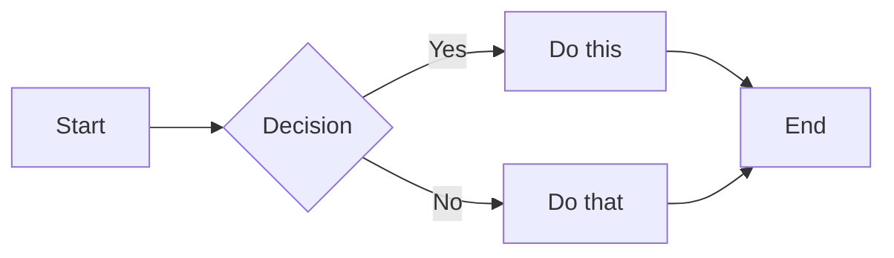
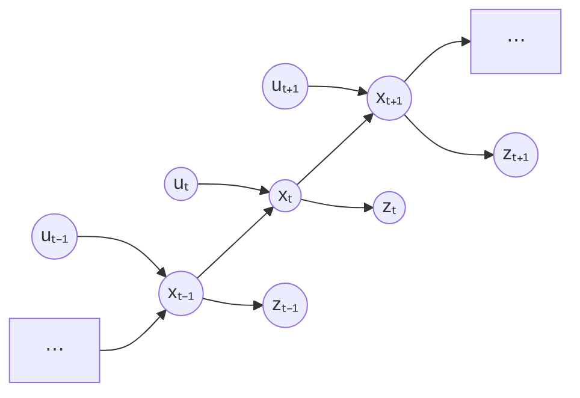

A short note demonstrating how to embed a **Mermaid flow chart** and math in a post.

## Mermaid flow chart

To show a Mermaid diagram, just use a fenced code block with the `mermaid` language tag:

````

````

Which renders as:


## Markov chain example



## Math

$$
\begin{bmatrix} x_k \\ z_k \end{bmatrix}
\;\big|\;
z_{1:k-1},u_{1:k}
\sim
\mathcal N\left(
\begin{bmatrix}
\bar\mu_k\\
H_k\bar\mu_k
\end{bmatrix},
\begin{bmatrix}
\bar\Sigma_k&\bar\Sigma_kH_k^\top\\
H_k\bar\Sigma_k&H_k\bar\Sigma_kH_k^\top+Q_k
\end{bmatrix}
\right).
$$
